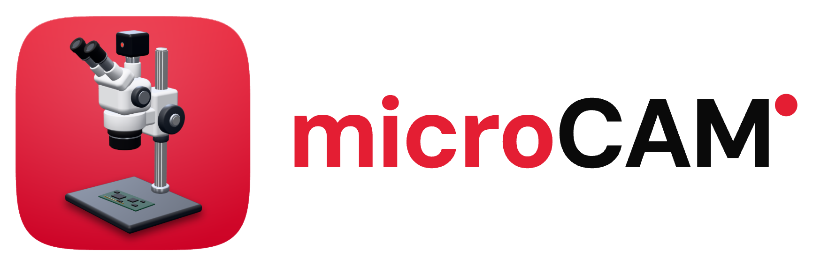
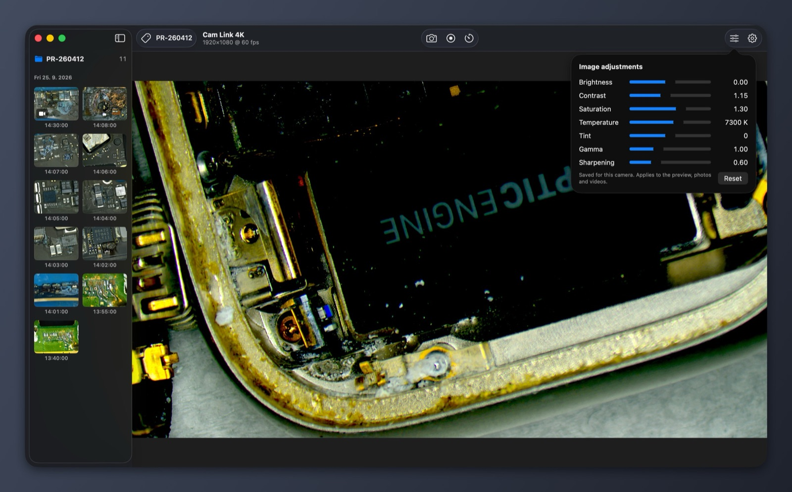
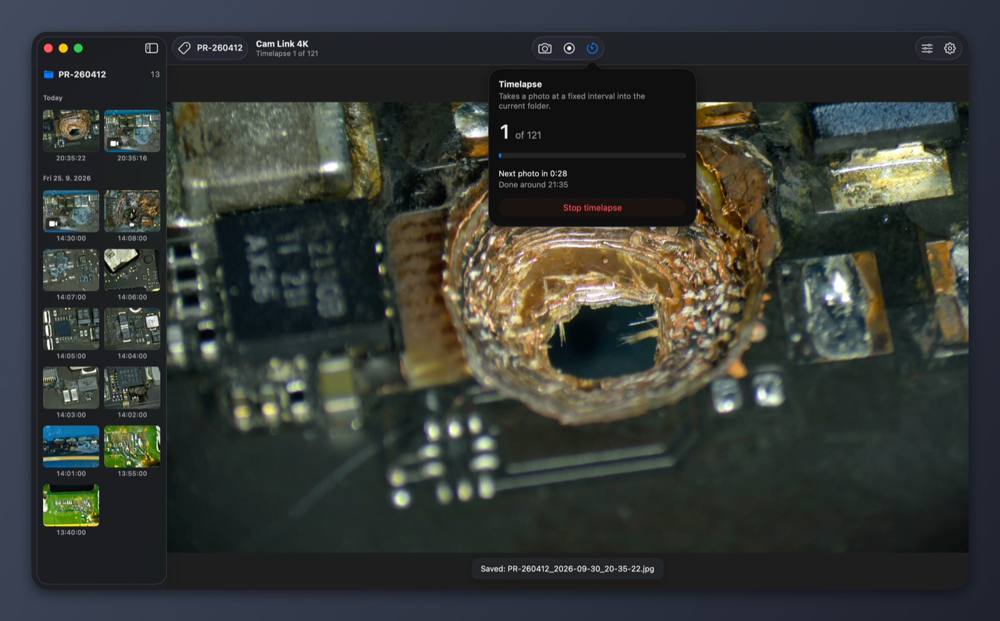
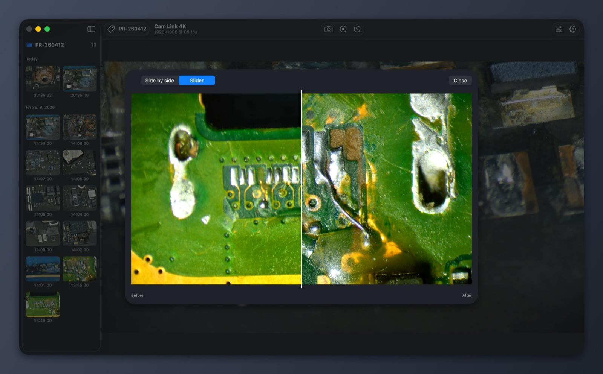
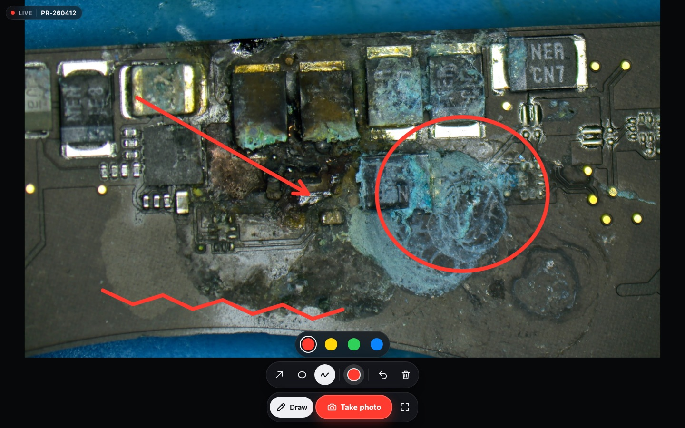
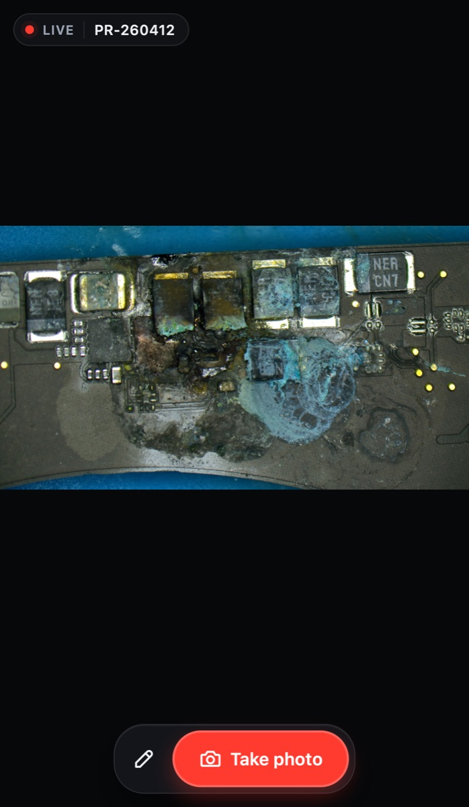
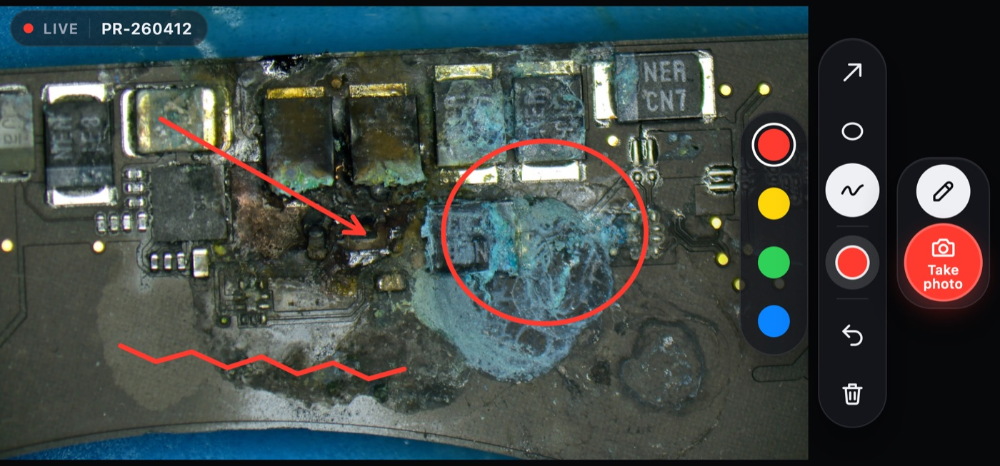

<p align="center">
  <picture>
    <source media="(prefers-color-scheme: dark)" srcset="docs/brand/logo-dark@2x.png">
    
  </picture>
</p>

# microCAM

**A small, native macOS app for the microscope camera at a repair bench.**
Live preview, photos, hour-long recordings with narration, timelapse and,
if you want, every capture filed under the job it belongs to. A *job* is a
repair order: the ticket or order number you already use for the repair.


microCAM works with any camera macOS can see: USB/UVC microscopes and HDMI
cameras behind a capture card such as the Elgato Cam Link 4K. It was built
to replace Plugable Digital Viewer on an Apple Silicon Mac. That app is
Intel-only, left running all week it used ~20 % CPU, and its recordings
started to stutter after a while.

The app is in English and Czech and follows the system language; you can
also pick one in *Settings → General → Language*.

## Highlights

- **Light enough to leave open for days.** The preview goes from the camera
  straight to the GPU. The camera stops while the window is hidden, the
  screen is locked or the Mac sleeps. microCAM also opts out of macOS camera
  effects (Reactions, Center Stage) that would otherwise analyse every frame.
- **Recordings that don't stutter.** Hardware HEVC/H.264 encoding, narration
  from any microphone, no length limit. A crash-safe file is written while
  recording.
- **Files sorted per job, if you want.** Turn on jobs, type the job code
  (`PR-260412`) and every photo and video lands in that job's folder.
  Misfiled shots can be moved later without overwriting anything.
- **Image adjustments per camera:** brightness, contrast, saturation, white
  balance, gamma and sharpening. They apply to the preview, photos and video
  alike, and cost nothing when switched off.
- **Digital zoom, grid, timelapse and before/after compare** (side by side or
  with a slider).
- **Web UI for phones, tablets and other computers:** the live picture in
  any browser on your network, with drawing over the image and remote photos
  for showing the customer their board. Or microCAM on another Mac as a
  viewer.
- **MCP server for AI agents:** agents on your network can look through the
  microscope, take photos and record, and you see everything they do.
- **Integrations:** macOS share sheet, and an optional generic webhook for
  sending captures to your own system (your CRM, n8n, Make, Zapier…).
- **Almost no dependencies.** Swift, SwiftUI/AppKit and Apple frameworks,
  plus [Sparkle](https://sparkle-project.org) for updates.

<table>
  <tr>
    <td width="33%"></td>
    <td width="33%"></td>
    <td width="33%"></td>
  </tr>
  <tr>
    <td align="center">Image adjustments</td>
    <td align="center">Timelapse</td>
    <td align="center">Before/after compare</td>
  </tr>
</table>

## Requirements

- macOS 14 or later, Apple Silicon or Intel
- Xcode command-line tools to build (`xcode-select --install`)

## Install

Download `microCAM-<version>.zip` from
[Releases](https://github.com/vaclavik-xyz/microCAM/releases), unzip it and
move `microCAM.app` to Applications. Releases from 0.2.0 on are signed with
Developer ID and notarized by Apple, and microCAM updates itself: it checks
for new versions (*Settings → General*, or *microCAM → Check for Updates…*)
and asks before installing. Versions 0.1.x have to be replaced by hand once.

## Build from source

```sh
scripts/make-app.sh                 # → build/microCAM.app (ad-hoc signed)
open build/microCAM.app             # or copy it to /Applications
scripts/deploy.sh <ssh-host> [dir]  # build → another Mac over ssh (universal)
scripts/release.sh                  # maintainers: signed, notarized GitHub release + appcast
```

Local builds are ad-hoc signed, so macOS asks for camera and microphone access
again after each build, and they don't update themselves (no update key).
`scripts/release.sh` describes the one-time setup for releases.

## Using it

On first launch microCAM asks where to save captures. It never picks a
folder on its own.

| Quick key | Menu shortcut | Action |
|---|---|---|
| `Space` | `⌘ T` | take a photo |
| `Space` in the side panel | | Quick Look of the selected files (a photo when nothing is selected) |
| `R` | `⌘ R` | start or stop recording |
| `G` | `⌘ '` | show or hide the grid |
| | `⌘ +` / `⌘ −` | zoom in / out |
| `0` | `⌘ 0` | reset zoom (or double-click the image) |
| | `⌘ ⇧ T` | timelapse |
| | `⌘ I` | image adjustments |
| scroll / pinch, drag | | zoom the preview, move the image |
| | `⌘ ,` | settings |

The quick keys are ignored while you type in a text field, so a job code
like `PR-2600` never triggers anything; the menu shortcuts work everywhere. Zoom and grid affect only the preview:
photos and videos are always full frame.

The window:

- **Toolbar.** Photo, video and timelapse sit together in the middle. Image
  adjustments and Settings are on the right, and the active job is on the
  left when jobs are on.
- **Side panel.** The captures of the current folder as thumbnails, grouped
  by day. Click selects, ⌘-click adds, ⇧-click selects a range, double-click
  opens, and you can drag a file into another app. The folder name at the top
  opens the folder; share and compare appear at the bottom once you select
  files. The panel remembers its
  width. Hide it with the button next to the window buttons.
- **Quick Look and Markup.** After a click in the side panel, Space opens
  the selected photos and videos in Quick Look, full size; the arrow keys
  move on. With nothing selected, or after a click in the picture, Space
  takes a photo. *Mark up…* (right
  click, or the pen button once one photo is selected) opens the system
  Markup editor, the one from Finder: arrows, shapes, text, loupe, crop.
  *Done* saves the result as a new copy next to the photo (`…_2.jpg`) and
  selects it; the original stays as it was. Quick Look on the Mac has no
  public editing mode, so microCAM runs the Markup extension
  (`com.apple.MarkupUI.Markup`) through `NSSharingService`; if a future
  macOS drops it, *Open in Preview* takes its place (Preview has the same
  Markup tools, and saves into the photo itself).
- **Title.** The camera (rename it in *Settings → Device*) and its format.
  While recording it shows the running time instead, and the stop button is
  red; a running timelapse shows its progress.
- **Preview.** Short messages like *Saved: …* show at the bottom and hide on their own.
  Errors stay until you close them.

### Where files go

```
<root>/microcam_2026-09-25_14-02-11.jpg               # default: no jobs
<root>/PR-260412/PR-260412_2026-09-25_14-30-00.mov    # jobs on, job PR-260412
<root>/_Unsorted/no-job_2026-09-25_15-00-00.jpg       # jobs on, no job set
```

- Two captures in the same second get `_2`, `_3`. Nothing is ever
  overwritten.
- **Settings → Storage** has two switches:
  - *Use jobs* is off by default, and everything goes straight into
    `<root>` as `microcam_…`. Turn it on to give each job (repair order)
    its own folder; the job is then set from the toolbar.
  - Turn on *Sort by type*, and each job gets `Photos/`, `Videos/` and
    `Timelapse/` subfolders.
- Folder names follow the app language (the Czech names are in
  `Sources/MicroCAMCore/FolderLanguage.swift`). microCAM lists and moves
  files named in any of its languages, so switching the language never
  hides existing captures.
- Recordings are written to `~/Library/Application Support/microCAM/Recording/`
  and moved into place when finished, so iCloud never uploads a half-written
  file. If a leftover file is found after a crash, microCAM opens that folder.

## Integrations

- **Share.** The side panel's share button (AirDrop, Mail, Messages, …) is
  always available.
- **Webhook.** *Settings → Integrations*, off by default. Selected captures
  are sent one by one as a `multipart/form-data` `POST`:

  | Field | Value |
  |---|---|
  | `file` | the JPEG / MOV |
  | `job` | job code from the file name (left out without one) |
  | `kind` | `photo`, `video` or `timelapse` |
  | `capturedAt` | ISO 8601 |
  | `idempotencyKey` | SHA-256 of the file, also sent as the `Idempotency-Key` header |

  An optional token is sent as `Authorization: Bearer …` and kept in the
  Keychain. Any 2xx counts as success. Videos are sent only when *Send videos
  too* is on; uploads stream from disk, so hour-long videos are fine.

### MCP server for AI agents

*Settings → Integrations → MCP server for AI agents*, off by default. AI
agents on other computers on your network (any client that speaks
[MCP](https://modelcontextprotocol.io) over Streamable HTTP) can then look
through the microscope, take photos and record. You can ask your agent
things like *"look at the camera: which chip is under the probe, and is
there corrosion around it?"* or *"take a photo of the board and record the
next five minutes"*.

1. Turn it on. microCAM creates a random token and keeps it in the Keychain.
   The port is 8091; change it only if another app uses it.
2. Click **Copy configuration** next to one of this Mac's addresses and paste
   it into the MCP settings of the agent's app:

   ```json
   {
     "mcpServers": {
       "microcam": {
         "headers": { "Authorization": "Bearer <token>" },
         "type": "http",
         "url": "http://<bench-ip>:8091/mcp"
       }
     }
   }
   ```

   A client that is set up differently needs just the same two things: the
   URL and the `Authorization` header.

| Tool | What it does |
|---|---|
| `get_status` | camera (your name for it), format, recording and for how long, timelapse, current folder and job |
| `capture_frame` | the live picture as a JPEG, with image adjustments, **not saved**; `max_size` (default 1568 px) |
| `take_photo` | same as the photo button: saves the photo, returns it and its file name |
| `list_captures` | newest photos and videos in the current folder: name, kind, time, size (`limit`, default 20) |
| `get_capture` | a photo from the current folder as an image; for a video only its details |
| `start_recording` / `stop_recording` | like the record button; stop waits until the video is saved |
| `set_job` | sets or clears (`""`) the job; listed only while jobs are on |

Errors (no camera, a recording already running, a wrong job code…) come back
as tool errors with a sentence the agent can act on.

The person at the bench sees what agents do: photos, recordings and job
changes show a message over the preview, and the window subtitle says
*Agent is watching* for 10 s after an agent last pulled a frame. A watching
agent keeps the camera on while the window is hidden, like a stream viewer.

Security:

- **Anyone with the token controls the camera.** Give it only to your own
  agents; *New token* locks out everyone using the old one.
- Every request needs `Authorization: Bearer <token>` (compared in constant
  time). After 5 wrong or missing tokens an address is refused for 5 minutes,
  even with the right token. The token is never logged or sent back.
- Like the stream, only local-network and Tailscale clients are accepted,
  and requests from a foreign browser origin are refused. Nothing listens
  while the server is off, and it never runs in viewer mode.

Protocol details: `POST /mcp`, one JSON-RPC message per request, JSON
responses (no SSE, no sessions; `GET` answers 405). Both MCP eras work: the
`initialize` handshake of revisions 2025-03-26 to 2025-11-25, and the
stateless 2026-07-28 revision (per-request `_meta`, mirrored headers,
`server/discover`). `scripts/mcp-smoke.py` checks a running server.

## Web UI: live stream and viewer

*Settings → Stream*, off by default. It shows the live picture on other
devices on the shop network or tailnet: open `http://<bench-ip>:8090/` in any
browser (the address is in Settings, with a Copy button). Or switch microCAM
on another Mac to **Viewer** (*Settings → General → Mode*); it finds the
camera computer via Bonjour.



<table>
  <tr>
    <td width="36%"></td>
    <td width="64%"></td>
  </tr>
</table>

- *Only watch*: just the picture, for a customer-facing screen.
- *Watch, draw and take photos*: full screen, drawing over the live image
  (arrow, circle, freehand, four colours) and **Take photo**. The photo is
  taken on the camera computer, into its current folder. Draw on it and
  **Save as photo** saves a copy with the drawing (`…_2.jpg`); the original
  stays untouched. Remote photos need the *PIN for photos* set on the camera
  computer; a wrong PIN locks the device out for a while.
- Made for touch: on a phone the buttons sit at the bottom in portrait and in
  a rail beside the picture in landscape, and every control is at least
  44 px (`scripts/stream-page-shots.py` checks that on phones, iPad and
  desktop).

The page follows the browser's language (the viewer app passes its own).
Only local-network and Tailscale clients are accepted. Nothing listens while
the stream is off, and nothing is encoded while nobody watches.

## Development

```sh
swift test                          # unit tests (MicroCAMCore) and translation checks
scripts/make-app.sh                 # app bundle
scripts/make-icon.sh                # recompile the app icon (needs Xcode 26)
scripts/make-screenshots.sh <photos> [en|cs] [out-dir]   # screenshots in demo mode (no camera needed)
scripts/stream-smoke.sh <host> [port] [pin]              # check a running stream
scripts/stream-page-shots.py <url> <dir> --pin <pin> [--locale cs-CZ]   # stream page on phones/iPad/desktop (demo stream only)
MICROCAM_MCP_TOKEN=<token> scripts/mcp-smoke.py <host> [port] [--write] [--lockout]   # check a running MCP server
```

Demo mode without a camera can also serve the stream on 127.0.0.1: set
`MICROCAM_DEMO_STREAM_PORT` (and optionally `MICROCAM_DEMO_STREAM_PIN`,
`MICROCAM_DEMO_STREAM_MODE=imageOnly`). `MICROCAM_DEMO_MCP_PORT` (and
optionally `MICROCAM_DEMO_MCP_TOKEN`) does the same for the MCP server; the
demo keeps its token in memory and never touches the Keychain one. The smoke script adapts to *Only
watch* and to a camera computer without a PIN. The page-shots script (Python
Playwright with WebKit) checks that every control is on screen, at least
44 px and not overlapping, and saves a screenshot per device and state.

- `Sources/MicroCAMCore` holds the pure logic: naming, storage, moving,
  settings, the image pipeline and policies. It is fully unit-tested.
- `Sources/MicroCAMApp` is the thin AVFoundation/SwiftUI layer.
- `Resources/<lang>.lproj` holds the translations.
- Design and plans live in `docs/superpowers/`. Measurements from the bench
  Mac go to `docs/acceptance.md`.
- Logo, app icon and social preview image live in `docs/brand/` (see its
  README for the colours and rules).
- The README image lives in `docs/images/`. `docs/screenshots/` is
  git-ignored because it may contain photos of customer boards.

## Contributing

Bug reports and pull requests are welcome. Don't add third-party dependencies
(Sparkle is the only one), put logic that can be tested into `MicroCAMCore` with a test,
and run `swift test` before you open a pull request.

### Localization

English is the source language: texts are written in English in the code,
and every language has a folder in `Resources/`:

- `Localizable.strings`: the app's texts. The key is the English text.
- `InfoPlist.strings`: what macOS shows when it asks for camera, microphone
  and local-network access.

The stream page keeps its texts in the `STRINGS` dictionary in
`Sources/MicroCAMApp/Streaming/StreamPage.swift`.

Every new text must be in every language. `swift test` fails with the file,
line and key when one is missing, empty or left in English by accident.

To add a language (German, `de`, as an example):

1. Copy `Resources/en.lproj` to `Resources/de.lproj` and translate the values
   (the part after `=`). Keep placeholders such as `%@` and `%lld`.
2. Add `<string>de</string>` to `CFBundleLocalizations` in
   `Resources/Info.plist`.
3. Add a `"de": { … }` entry with the same keys to `STRINGS` in
   `StreamPage.swift`.
4. Run `swift test`. If a text should stay the same as in English (a product
   name, for example), add it to `sameAsEnglish` in
   `Tests/LocalizationTests/LocalizationTests.swift`.
5. Build with `scripts/make-app.sh` and check the screens with
   `scripts/make-screenshots.sh <photos> de <out-dir>`.

The language then appears in *Settings → General → Language* by itself.
New folders get English names unless `FolderLanguage`
(`Sources/MicroCAMCore/FolderLanguage.swift`) gets names for the language too.

## License

MIT, see [LICENSE](LICENSE).
