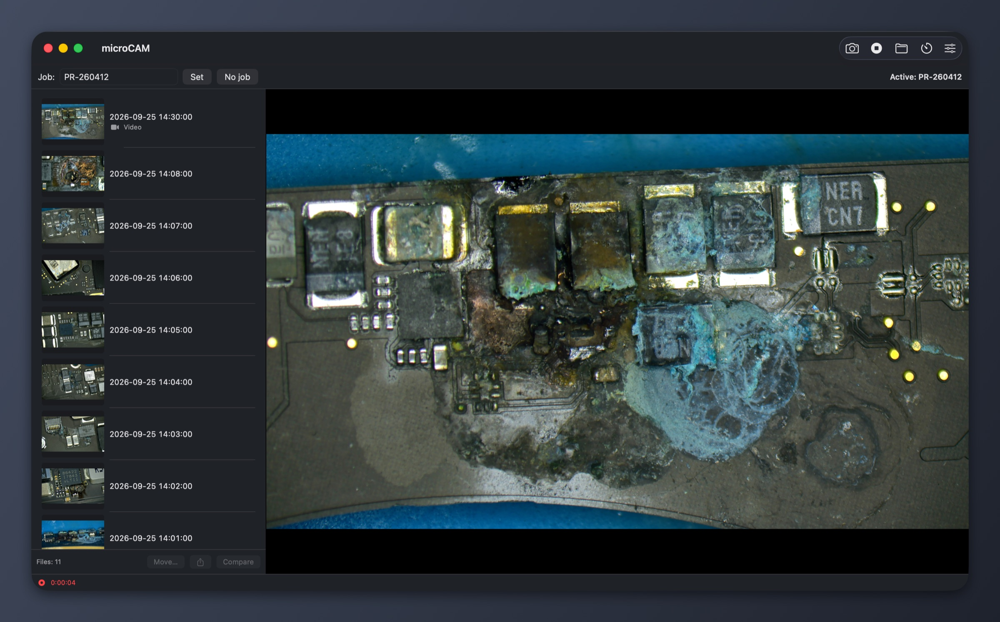

# microCAM

**A small, native macOS app for the microscope camera at a repair bench.**
Live preview, photos, hour-long recordings with narration, timelapse, and
every capture filed under the repair order it belongs to.



microCAM works with any camera macOS can see: USB/UVC microscopes and HDMI
cameras behind a capture card such as the Elgato Cam Link 4K. It was built
to replace Plugable Digital Viewer on an Apple Silicon Mac. That app is
Intel-only, left running all week it used ~20 % CPU, and its recordings
started to stutter after a while.

## Highlights

- **Light enough to leave open for days.** The preview goes from the camera
  straight to the GPU. The camera stops while the window is hidden, the
  screen is locked or the Mac sleeps. microCAM also opts out of macOS camera
  effects (Reactions, Center Stage) that would otherwise analyse every frame.
- **Recordings that don't stutter.** Hardware HEVC/H.264 encoding, narration
  from any microphone, no length limit. A crash-safe file is written while
  recording.
- **Files sorted per repair order.** Type the order number (`PR-260412`) and
  every photo and video lands in that order's folder. Misfiled shots can be
  moved later without overwriting anything.
- **Image adjustments per camera:** brightness, contrast, saturation, white
  balance, gamma and sharpening. They apply to the preview, photos and video
  alike, and cost nothing when switched off.
- **Digital zoom, grid, timelapse and before/after compare** (side by side or
  with a slider).
- **Live stream** to a browser or to microCAM on another Mac, with remote
  photos and annotations for showing the customer their board.
- **Integrations:** macOS share sheet, and an optional generic webhook for
  sending captures to your own system (CRM, n8n, Make, Zapier…).
- **No third-party dependencies.** Swift, SwiftUI/AppKit and Apple
  frameworks only.

## Requirements

- macOS 14 or later, Apple Silicon or Intel
- Xcode command-line tools to build (`xcode-select --install`)

## Build and install

```sh
scripts/make-app.sh                 # → build/microCAM.app (ad-hoc signed)
open build/microCAM.app             # or copy it to /Applications
scripts/deploy.sh <ssh-host> [dir]  # build → another Mac over ssh (universal)
scripts/deploy-bench.sh          # the same for bench Mac
```

The app is ad-hoc signed for personal use, so macOS may ask for camera and
microphone access again after an update.

## Using it

On first launch microCAM asks where to store captures. It never picks a
folder on its own.

| Key | Action |
|---|---|
| `Space` | take a photo |
| `R` | start / stop recording |
| `G` | toggle the grid |
| `0` | reset zoom (or double-click the image) |
| scroll / pinch, drag | zoom the preview, pan |
| `⌘ ,` | settings |

Shortcuts are ignored while you type in a text field, so a job code like
`PR-2600` never triggers anything. Zoom and grid affect only the preview:
photos and videos are always full frame.

### Where files go

```
<root>/PR-260412/PR-260412_2026-09-25_14-02-11.jpg
<root>/PR-260412/PR-260412_2026-09-25_14-30-00.mov
<root>/_Nezařazeno/bez-zakazky_2026-09-25_15-00-00.jpg      # no job set
```

- Two captures in the same second get `_2`, `_3`. Nothing is ever
  overwritten.
- **Settings → Storage** has two switches:
  - Turn repair orders off, and everything goes straight into `<root>` as
    `microcam_…`.
  - Turn on sorting by type, and each order gets `Fotky/`, `Videa/` and
    `Časosběr/` subfolders.
- Recordings are written to `~/Library/Application Support/microCAM/Recording/`
  and moved into place when finished, so iCloud never uploads a half-written
  file. If a leftover file is found after a crash, microCAM opens that folder.

## Integrations

- **Share.** The side panel's share button (AirDrop, Mail, Messages, …) is
  always available.
- **Webhook.** *Settings → Integrations*, off by default. Selected captures
  are sent one by one as a `multipart/form-data` `POST`:

  | Field | Value |
  |---|---|
  | `file` | the JPEG / MOV |
  | `job` | repair-order code from the file name (omitted without one) |
  | `kind` | `photo`, `video` or `timelapse` |
  | `capturedAt` | ISO 8601 |
  | `idempotencyKey` | SHA-256 of the file, also sent as the `Idempotency-Key` header |

  An optional token is sent as `Authorization: Bearer …` and kept in the
  Keychain. Any 2xx counts as success. Videos are sent only when "Posílat i
  videa" is on; uploads stream from disk, so hour-long videos are fine.

## Live stream and viewer

*Settings → Přenos*, off by default. It streams the live image to other
devices on the shop network or tailnet. Open `http://<bench-ip>:8090/` in any
browser, or switch microCAM on another Mac to **Prohlížeč** mode (*Settings →
Režim appky*); it finds the bench via Bonjour.

- *Jen obraz*: just the picture, for a customer-facing screen.
- *S ovládáním*: job code, full screen, drawing over the live image, and
  **Vyfotit**. The photo is taken on the bench into the active job. Draw on
  it and **Uložit k zakázce** saves an annotated copy (`…_2.jpg`); the
  original stays untouched. Remote photos need the PIN set on the bench.

Only local-network and Tailscale clients are accepted. Nothing listens while
the stream is off, and nothing is encoded while nobody watches.

## Development

```sh
swift test                          # unit tests for MicroCAMCore
scripts/make-app.sh                 # app bundle
scripts/make-screenshots.sh <dir>   # screenshots in demo mode (no camera needed)
scripts/stream-smoke.sh <host> [port] [pin]   # check a running stream
```

Demo mode without a camera can also serve the stream on 127.0.0.1: set
`MICROCAM_DEMO_STREAM_PORT` (and optionally `MICROCAM_DEMO_STREAM_PIN`,
`MICROCAM_DEMO_STREAM_MODE=imageOnly`). The smoke script adapts to *Jen obraz*
and to a bench without a PIN.

- `Sources/MicroCAMCore` holds the pure logic: naming, storage, moving,
  settings, the image pipeline and policies. It is fully unit-tested.
- `Sources/MicroCAMApp` is the thin AVFoundation/SwiftUI layer.
- Design and plans live in `docs/superpowers/`. Measurements from the bench
  Mac go to `docs/acceptance.md`.
- The README image lives in `docs/images/`. `docs/screenshots/` is
  git-ignored because it may contain photos of customer boards.
